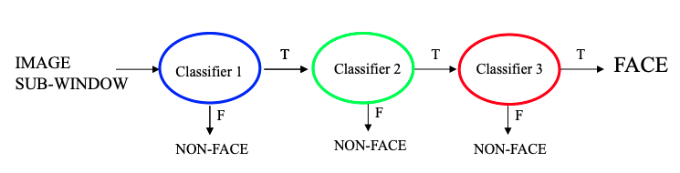

# Computer Vision Face Censorship Project
## Group Members: Jennifer Lau and Steven Luong
### Project Background
We are trying to solve the issue of privacy in pictures. We are planning to detect faces within a picture and censor them to maintain the privacy of those people. By censoring, we mean using stickers or other preselected images will be used to cover a person’s face to hide their identity.

### Algorithm Used
We implemented the AdaBoost machine learning algorithm to help our code learn and recognize faces in a picture. The AdaBoost algorithm allows us to train on many weak classifiers. As we train on the weak classifiers, our code will calculate weights for each classifier which will help with the accuracy of the final classifier; the final classifier will be composed of the weak classifiers we were training our model on, so the weights will tell the final classifer how influential each of our weak classifiers should be.

Although the AdaBoost algorithm can help us better train our model, we can improve our model by using cascades. Cascades are basically extra layers of classifiers that we can use to help our model weedout non-faces. If we look at the following image, we can see that there are three classifier levels for this model. For the image we are trying to classify, if at any point the classifier determines that the image is a non-face, we can immediately stop the algorithm and determine the image is at a non-face. However, if the first classifier determines the image is a face, we will move onto the second classifier, and if that classifier determines the image is face, it will move onto the final classifier. With each classifier we go through, the stricter the requirement gets which helps with the accuracy of the face detection.

Training and developing the face detection is the hardest part of our project. However, after we got that portion set up, we just need to use our model to help us verify if a picture given has a face or not. If it does have a face, we can use the Python Pillow library to help us layer the censor image on top of the face in order to censor. Finally, we can save the result in a new image and have a fully face censored version of the image.

However, not everything went smoothly... Issues arose in training the classifier, and we eventually opted to use the Open CV cascading classifier. We have still included our code that we tried implementing!

### Code Implemented
All of the face detection code in the Main.py, CascaseDetector.py, Helper.py were written from scratch. However, there were some resources we referenced to help us learn more about face detection and getting started. We learned about the face detection algorithm from these [slides](https://courses.cs.washington.edu/courses/cse455/16wi/notes/15_FaceDetection.pdf) and this [medium article](https://medium.datadriveninvestor.com/understanding-and-implementing-the-viola-jones-image-classification-algorithm-85621f7fe20b) helped us better understand the algorithm and how to code it. In addition to those resources, we also used the Python [Pillow](https://pillow.readthedocs.io/en/stable/) library to help us with using and manipulating the images for our code.

### Issues
One issue was having to learn the algorithm. We have a little bit of knowledge about machine learning, but neither of us know too much about machine learning to be able to implement the algorithm without issues. So there was lot of research and reading that went along with implementing the algorithm.

Howeverm the major issue was that it takes a very long time to train our model. When trying to train on the full dataset of over 7000 images, it took over 3 hours on the CSE attu servers before the code encounters a bug and crashes. Even when adding an if statement to avoid the error, after more than four hours, it was still training, and we weren't even sure if the model was correct yet; we were just trying to get it make it through without an error!

Even though our code crashed on the large dataset, it was able to compile and execute successfully with a smaller dataset (which has 6 photos) so we believe that our code is mostly correct. The bug with our code most likely lies with rounding or overflow error due to it handling such a large dataset. Since it takes such a long time for the code to even reach that point of crashing, we decided it may be better to depend on openCV to handle the face recognition portion of our project; we have already spent about two weeks work of time in order to research, implement, and test our version of the face detection algorithm so we believe that we made a good enough attempt with writing the code from scratch and can move on with utilizing a library.

### Data used
We used the MIT CBCL face database to help us train our model. The data can be download [here](http://cbcl.mit.edu/software-datasets/FaceData2.html). The dataset is all 19x19 grayscale images. In the training set, there are 2492 faces and 4548 non-faces. In the testing set, there are 472 faces and 23573 non-faces.

### Video Walktrhough of Our Project
[https://youtu.be/kJJ81sQligQ](https://youtu.be/kJJ81sQligQ)
